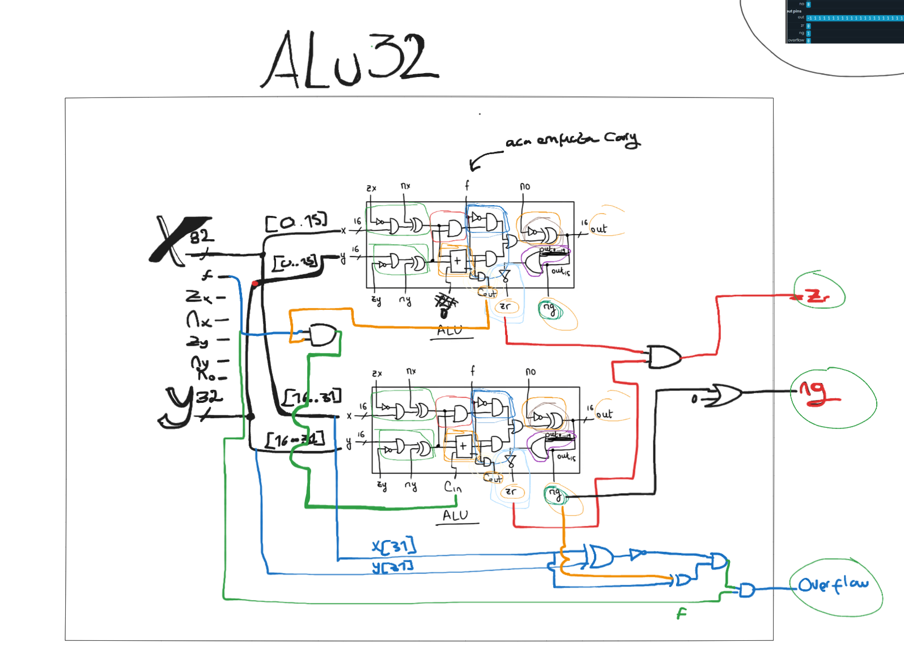

# ALU de 16 y 32 bits – Documentación de diseño

## Resumen
Implementé tres componentes clave: `Add16Carry`, `ALU16C` y `ALU32`. El objetivo fue construir una ALU escalable de 32 bits reutilizando bloques de 16 bits y una suma con carry explícito. Busqué simplicidad y claridad en las señales de control: `zx nx zy ny f no`.

## Objetivos de diseño
- Reutilizar un sumador de 16 bits con entrada de acarreo (`Add16Carry`).
- Encapsular la lógica de control (zero/negate, AND / ADD, negate output) en `ALU16C`.
- Escalar a 32 bits encadenando dos `ALU16C` y propagando carry condicionalmente.
- Generar flags: `zr` (zero), `ng` (signo), `overflow` (solo suma/resta en 32 bits).
- Mantener el diseño fácilmente extensible a 64/128 bits.

## Add16Carry
Sumador ripple-carry de 16 bits con entrada y salida de acarreo:
- Internamente 16 `FullAdder` en cascada.
- Expone `cIn` y `cOut` para permitir encadenamiento (importante para ALU de más de 16 bits).
- Elección: mantener ripple por simplicidad; no se implementó carry lookahead porque el curso prioriza construcción a partir de compuertas básicas.

## ALU16C
Bloque ALU de 16 bits con control completo y acarreo de entrada/salida:
- Preprocesamiento de cada operando: para `x` y `y` genero su negado (`Not16`) y selecciono entre: original, negado, cero, todo 1s usando un `Mux4Way16` con combinación (`zx`, `nx`) y (`zy`, `ny`). Esta tabla compacta las operaciones "zero" y "negate" en un solo multiplexor por operando.
- Operaciones principales: `And16` y `Add16Carry` sobre los operandos normalizados `xf` y `yf`.
- Selección de función: `Mux16` elige entre AND y ADD según `f`.
- Posible negación final: si `no`=1 se invierte el resultado (`Not16` + `Mux16`).
- Flags:
  - `ng`: se toma directamente del bit 15 del resultado (signo en complemento a dos).
  - `zr`: OR jerárquico (dos `Or8Way` + `Or` + `Not`).
  - `cOut`: solo se propaga si la operación fue aritmética (`f=1`), usando `And(f, carryAdd)`.
- Decisión: encapsular las transformaciones de entrada en cada bloque para reutilización directa en diseños mayores.

## ALU32
Construida con dos `ALU16C`:
- Parte baja (`x[0..15]`, `y[0..15]`) con `cIn=false`.
- Carry condicional a la parte alta: `carryIntoHigh = f AND carryLow` (solo tiene sentido en suma/resta).
- Parte alta produce el bit de signo final (`resSign`).
- `zr = zrLow AND zrHigh` (composición de flags sin OR de 32 bits).
- Salida: actualmente dos `Mux16` con `sel=false` (podrían eliminarse y cablear directo para optimizar).
- `ng` = `resSign`.
- `overflow` calculado con la regla estándar para suma/resta con signo: operandos con mismo signo y resultado con signo distinto. Implementación: Xor/Not/Xor/And/And.

## Decisiones clave
- Uso de `Mux4Way16` para combinar zero y negate en un solo bloque por operando: reduce compuertas respecto a encadenar Mux + Not + lógica adicional.
- Propagación condicional del carry entre mitades controlada por `f` evita que operaciones lógicas afecten el estado aritmético.
- Cálculo de `zr` compuesto de flags parciales (`zrLow`, `zrHigh`) ahorra una cadena de OR sobre 32 bits.
- Separación en bloques de 16 bits mantiene escalabilidad a 64/128 bits repitiendo patrón (solo añadir más `ALU16C` y AND acumulativo para `zr`).
- Lógica de overflow segregada en la capa de 32 bits para no complicar el bloque de 16 bits: reutiliza solo bits de signo y resultado final.

## Posibles optimizaciones futuras
- Eliminar los dos `Mux16` con `sel=false` en `ALU32` (cableado directo).
- Compartir o preprocesar operandos a 32 bits para eliminar duplicación de `Not16` y `Mux4Way16` por mitad.
- Compactar la lógica de overflow en una expresión con menos señales intermedias.

## Escalabilidad
Para 64/128 bits: encadenar 4/8 bloques `ALU16C`, ripple de carry, AND de todos los `zr` parciales, signo del último bloque, misma fórmula de overflow con el MSB.

## Diagramas
### Half Adder y Full Adder

### Como funciona el Carry y overflow

### Add 16 Carry

### Alu16Carry
- Comparativo con el codigo

### Alu 32

### Resultado de las pruebas
#### 1 
- ADD simple: 1 + 2 = 3 (sin carry)
  
- ADD con acarreo: 0x0000FFFF + 0x00000001 = 0x00010000 (carry propaga).
  
- SUB negativa: 3 - 5 = -2 (ng=1).
  
- ADD con overflow: 0x7FFFFFFF + 1 (debe detectar overflow).
  
- AND/OR con máscaras: 0xAAAAAAAA & 0x55555555 = 0.
  
- Acarreo solo en bit 16: Verifica propagación.
  
- NEGATIVE: Resultado con bit 31=1.
  